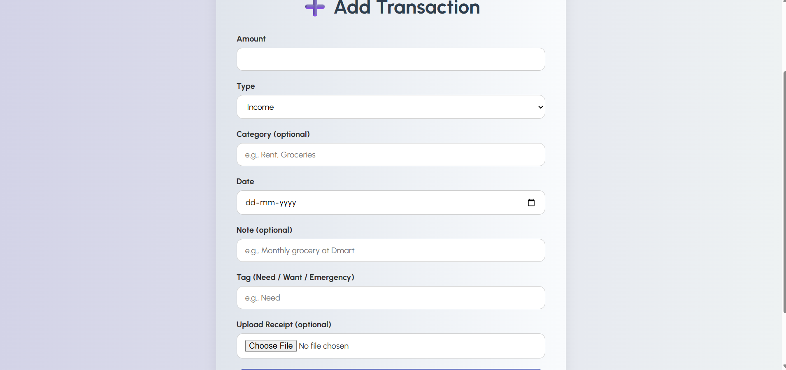
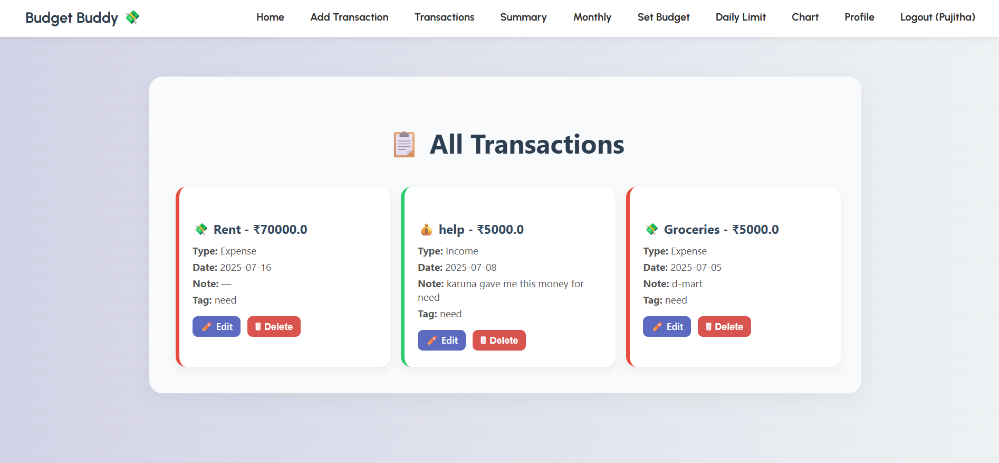
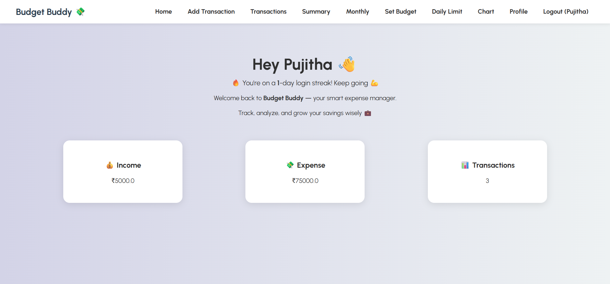
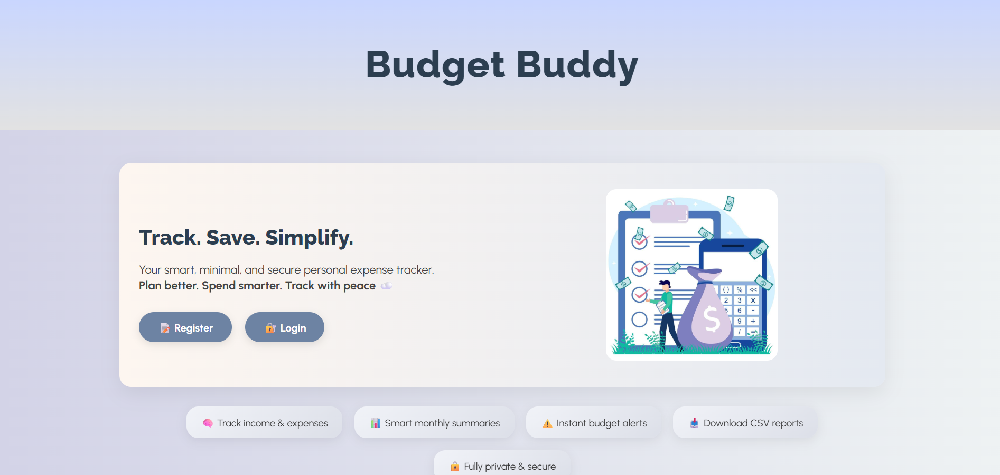
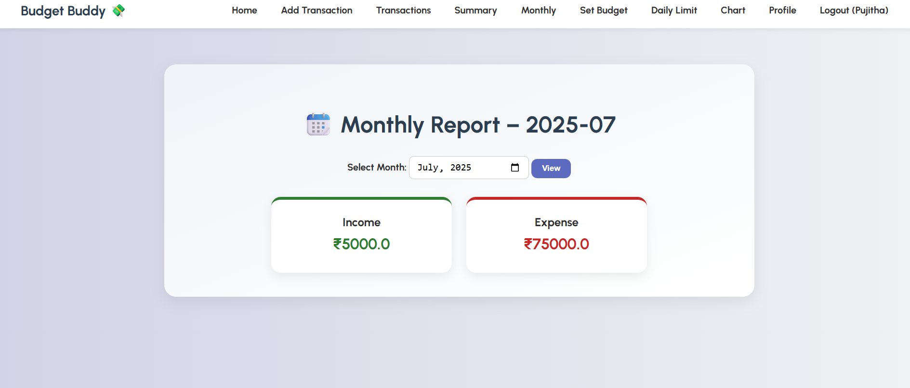
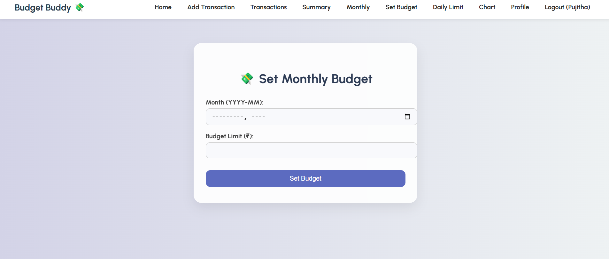
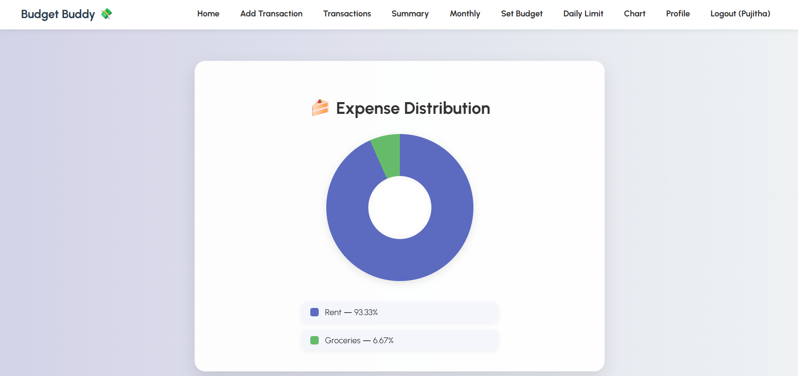

#  Budget Buddy — Smart Personal Expense Tracker


A minimal yet powerful expense tracker that helps you stay in control of your spending.  
Built with Flask + SQLite, and powered by real-world DSA techniques to give you fast, smart, and meaningful insights.

---

##  What is Budget Buddy?

Budget Buddy is your personal finance assistant.  
Track your daily spending, set monthly budgets, upload receipts, and see where your money goes — all in a clean and simple dashboard.

Unlike boring finance apps, Budget Buddy comes with smart logic and creative design — powered by algorithms, not just forms.

>  Still evolving... improving daily... there’s so much more to build!

---

##  Key Features

- Add, Edit, and Delete transactions
- Track daily expenses with visual limits
- Set monthly budgets and get alerts if you exceed them
- Category-wise expense summaries (like Food, Travel, Rent)
- Visualize expenses using pure CSS pie charts
- Upload and view receipts for transactions
- Add tags: Need, Want, or Emergency
- Filter expenses by custom date range
- Export transactions as a CSV file
- Secure login system with user-based dashboards

---

##  DSA + Logic Behind the Scenes

This project uses real-world Data Structures & Algorithms:

- Prefix Sum for fast monthly/daily totals
- Filtering & Grouping using Python dictionaries
- Date-based filtering logic
- Hashing techniques for category-wise summaries
- File handling for CSV export and receipt upload

---

##  Tech Stack

- Frontend: HTML, CSS
- Backend: Python, Flask
- Database: SQLite with SQLAlchemy
- Other: Jinja2 templates, File upload, Session-based login

---

##  How to Run Locally

1. Clone this repo  
```bash
git clone https://github.com/pujitha-20/budget-buddy.git
cd budget-buddy
```

2. Create a virtual environment and activate it  
```bash
python -m venv venv
source venv/bin/activate   # On Windows: venv\Scripts\activate
```

3. Install dependencies  
```bash
pip install -r requirements.txt
```

4. Run the app  
```bash
python app.py
```

5. Open in browser:  
```
http://localhost:5000
```

---
##  Screenshots

###  Add Transaction  
[](static/images/add_transaction.png)

###  All Transactions  
[](static/images/all_transactions.png)

###  Home Dashboard  
[](static/images/Home.png)

###  Landing Page  
[](static/images/landing.png)

###  Monthly Report  
[](static/images/monthly_report.png)

###  Monthly Budget  
[](static/images/monthly-budget.png)

###  Pie Chart  
[](static/images/piechart.png)


---

##  Future Enhancements

-  Integrate advanced authentication (Email/OTP-based login)
-  Add JavaScript-powered interactive dashboards with real-time updates
-  Show intelligent spending insights using visual graphs and trends
-  Add dark mode toggle with local storage preference
-  Add user notes/comments for each transaction
-  Add smart budget suggestions based on past behavior
-  Enable automatic monthly report emails to users
-  Integrate cloud storage (like Firebase or S3) for storing receipts

---

## Folder Structure

```
budget-buddy/
│
├── app.py
├── models.py
├── requirements.txt
├── database.db
├── static/
│   └── style.css, images/
├── templates/
│   └── index.html, dashboard.html, chart.html, ...
└── README.md
```

---

##  Built by Pujitha

A work in progress fueled by curiosity and determination.  
Open to collaborations, ideas, and improvements!

                   *** Thank you ****
